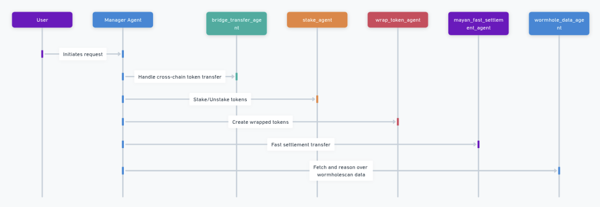

# XchainGPT

**XchainGPT** is a multi-agent, cross-chain DeFi operator powered by LLMs. It enables seamless, intelligent interaction across **Solana** and **Ethereum** networks using the **Wormhole SDK**.

With XchainGPT, users can issue natural-language commands to complete complex DeFi operations—like transferring tokens between chains or staking assets—while agents work together in the background to execute the required steps.

## 🔗 What XchainGPT Can Do

XchainGPT simplifies cross-chain DeFi by supporting:

- 🔁 **Transfer tokens between chains**  
- 📥 **Stake tokens** on a chain  
- 📤 **Unstake tokens** from a chain  
- 💰 **Check token balances** on a chain  
- 💹 **Check token prices** on a chain  
- 📊 **Fetch Wormhole protocol data**

XchainGPT abstracts away the need for users to interact with multiple smart contracts and protocols—just tell it what you want, and it coordinates everything using its agent system.

## 🧠 Multi-Agent System

XchainGPT delegates specific tasks to specialized agents to complete user workflows. These include:

- `manager_agent`: high level planning and delegation to other agents
- `bridge_transfer_agent`: Handles generic cross-chain token transfers  
- `stake_agent`: Stakes and unstakes tokens on supported chains  
- `wrap_token_agent`: Create wrapped tokens
- `mayan_fast_settlement_agent`: Agent for fast settlement transfers
- `wormhole_data_agent`: Fetches and reasons over wormholescan data (see below for python backend module)

  Navigate to `src/agents` to view agents. `wormhole_data_agent` is in python module.

### Example of successful WH fast transfer across chains:

**Origin Transaction Hash (Ethereum):** [0x98f8703072d3c0f8e9a479ffd7cdc3899c0b06546378b7a0aec2a0b55ba95b01](https://etherscan.io/tx/0x98f8703072d3c0f8e9a479ffd7cdc3899c0b06546378b7a0aec2a0b55ba95b01) 

**Destination Transaction Hash (Solana):** [3TAYt2CXK2oiwXkPooU8UDqPVyLUYdfNMuWsrw2PqkNpAfrsbGuTi22RGWPxhxjsM9QsTBQ6mzc4bHCMASvnP3H7](https://solscan.io/tx/3TAYt2CXK2oiwXkPooU8UDqPVyLUYdfNMuWsrw2PqkNpAfrsbGuTi22RGWPxhxjsM9QsTBQ6mzc4bHCMASvnP3H7) The transaction involved transferring **0.0026 WETH* from Ethereum and receiving *0.025994274 wSOL* on Solana. Everything has been completed successfully.

## Wormhole Data Agent

This Python module creates a LangChain agent that interacts with the WormholeScan API to fetch blockchain bridge data (e.g., transactions and cross-chain activity).
Loads a chain ID name mapping. 
Sets up tools (API wrappers) to fetch data.
Formats results in human-readable form. 
Uses an OpenAI LLM (gpt-4) as the reasoning engine. 
Enables natural language queries via the agent. 

**Key Parts & Their Purpose:**

1. **chain_name_to_id** / **id_to_chain_name** Maps blockchain names (like "Ethereum") to their numeric chain IDs used in API responses, and vice versa. 
2. **system_prompt** Provides instructions to the LLM on how to: Convert chain IDs to names in outputs. Use tools to fetch real-time data. Present data in a user-friendly way. 
3. **ChatOpenAI(...)** Initializes GPT-4 with the system prompt, giving the AI context and behavior rules. 
4. **get_observations_by_tx(...)** Purpose: Fetch observations (blockchain messages) based on a transaction hash. Key features: Hits /api/v1/observations. Cleans each observation: Shows readable timestamps. Truncates long signatures. Extracts chain, address, and sequence info. 
5. **get_cross_chain_activity(...)** Purpose: Gets top cross-chain app activity for a specific time range. Key features: Hits /api/v1/x-chain-activity/tops. Supports filtering by app, source chain, or target chain. Returns raw API data (can be extended to clean the result). 
6. **get_last_wormhole_transactions(...)** Purpose: Fetches recent Wormhole bridge transactions. Key features: Hits /api/v1/last-txs. Can filter by time and sample rate. Handles different response formats safely. 
7. **agent = initialize_agent(...)** Purpose: Initializes a LangChain OpenAI-powered agent with the three tools above. Behavior: Can take natural language questions like: “How many transactions happened on Ethereum yesterday?” “Show me observations from this transaction hash.” The agent decides which tool(s) to use to answer based on the prompt and the tools’ descriptions. 

**Example queries:**

{"query":"What was the cross chain activity of tokens from the past 1 days till now?"}
(to test the get_cross_chain_activity function)

{"query":"What is the total amount of transactions yesterday with a sample rate of 1 hour?"}
(to test the get_last_wormhole_transactions function)

{"query":"Show me the transactions in the past 9 hours"}
(to test the get_last_wormhole_transactions function)

______________
# Setup Instructions

To set up and run the project, follow these steps:

**Frontend (Demo SDK)**
1.  Navigate to the frontend project directory:
	`cd demo-basic-ts-sdk`
2.  Install all the required dependencies:
	`npm i`

This downloads all the packages listed in the package.json file so the project can run properly.
3.  Start the frontend development server:
	`npm run start`

This runs the frontend on a local development server.
______________
**Backend (Python Information Service)**
1.	Navigate to the backend folder:
	`cd python_backend`
2.	Install the Python dependencies:
	`pip install -r requirements.txt`
This command installs all the necessary Python packages listed in the requirements.txt file, which are needed for the backend server to run.
3.	Run the Python backend service:
	`python Flask.py`
This will start the Flask server, which powers the backend information service module.
4.  After the server is running, you can access the service at:
	`http://localhost:5000/query`

